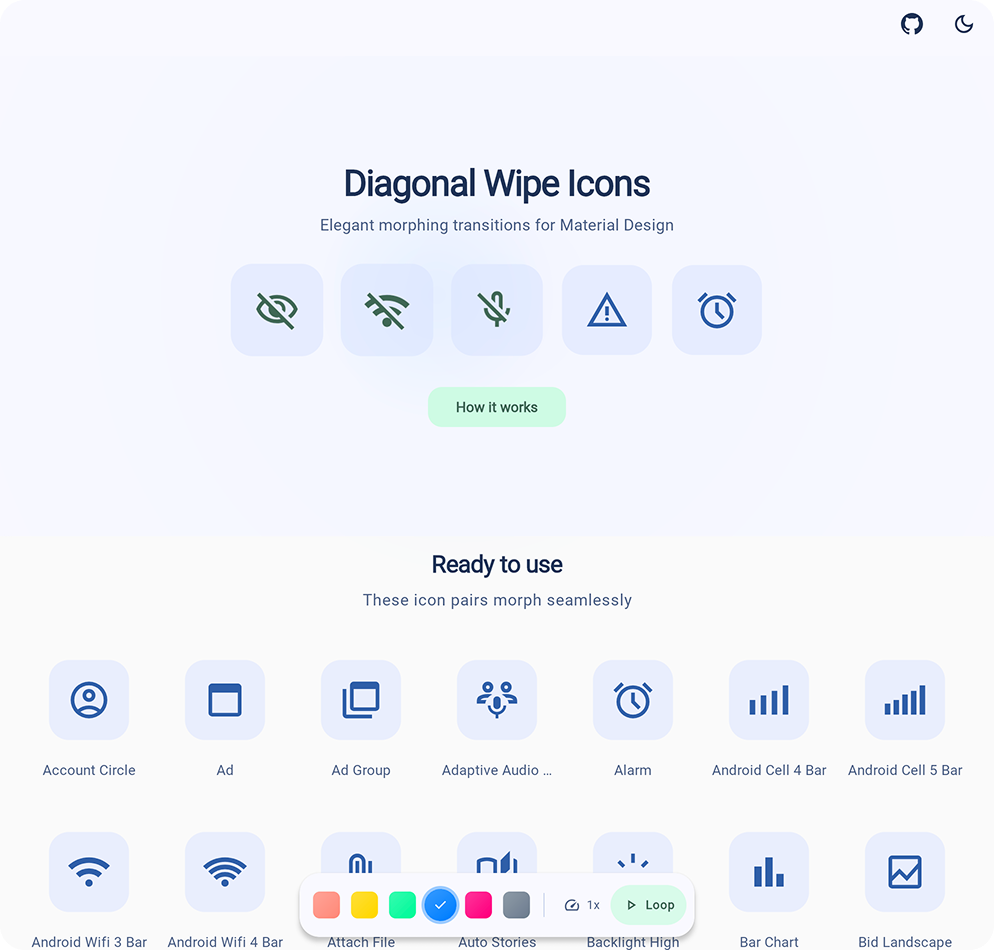
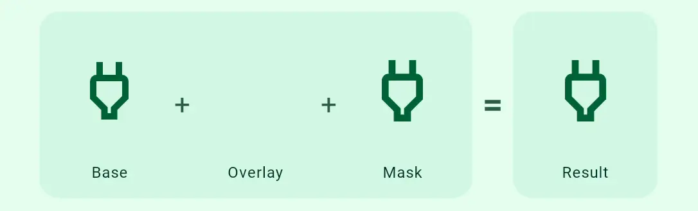
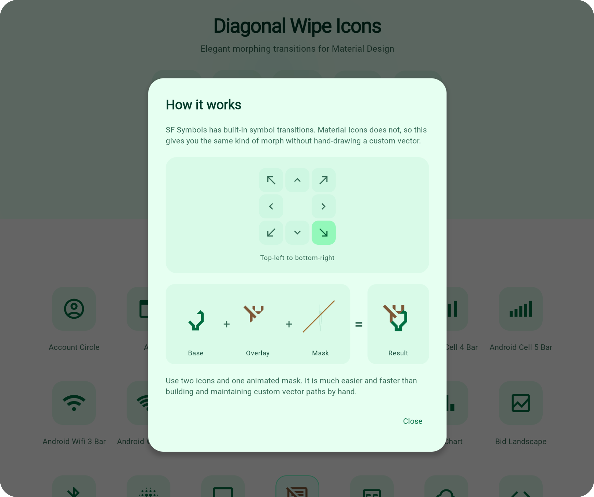

<div align="center">

<a href="https://bernaferrari.github.io/diagonal-wipe-icon/"></a>

# Diagonal Wipe Icon
**One-file icon transition component for Compose Multiplatform**

<a href="https://bernaferrari.github.io/diagonal-wipe-icon/"></a>

**[🚀 Live Demo](https://bernaferrari.github.io/diagonal-wipe-icon/)**

</div>

## 📖 What Is This?

Apple's **SF Symbols** makes it easy to add wipe icon transitions to iOS apps. In Compose, achieving this built-in behavior is tedious—it often requires creating animated drawables manually or relying on third-party editors every single time. 

**Diagonal Wipe Icon** bridges this gap. It provides a polished component that emulates this behavior using two standard icons and a mask. Perfect for:
- 🎛️ **Toggle controls** (`on/off`, `enabled/disabled`, `visible/hidden`)
- ⚙️ **Settings screens** with stateful icons
- ✨ **Anywhere** you want polished micro-interactions

**Zero dependencies. Just copy a single file.**

## � Quick Start

Grab the file:
```bash
curl -O https://raw.githubusercontent.com/bernaferrari/diagonal-wipe-icon/main/composeApp/src/commonMain/kotlin/com/bernaferrari/diagonalwipeicon/DiagonalWipeIcon.kt
```
Drop it into your `commonMain/kotlin` folder, and wrap it in your preferred click listener:

```kotlin
@Composable
fun FavoriteButton() {
    var isFavorite by remember { mutableStateOf(false) }

    IconButton(onClick = { isFavorite = !isFavorite }) {
        DiagonalWipeIcon(
            isWiped = !isFavorite,
            baseIcon = Icons.Outlined.Favorite,
            wipedIcon = Icons.Outlined.FavoriteBorder,
            contentDescription = "Favorite Toggle"
        )
    }
}
```

## 🎨 Customization
You can deeply customize the transition feel using `motion` parameter or custom `Painter`s.

```kotlin
DiagonalWipeIcon(
    // State and Icons
    isWiped = isMuted,
    baseIcon = Icons.Outlined.VolumeUp,
    wipedIcon = Icons.Outlined.VolumeOff,
    
    // Optional Colors
    baseTint = Color.Unspecified,
    wipedTint = Color.Unspecified,
    
    // Motion Presets
    motion = DiagonalWipeIconDefaults.gentle() // default, smooth feel
    // motion = DiagonalWipeIconDefaults.snappy() // fast and responsive feel
    // motion = DiagonalWipeIconDefaults.gentle(direction = WipeDirection.TopToBottom) // 8 cardinal/diagonal directions supported
    // motion = DiagonalWipeIconDefaults.spring(wipeInStiffness = Spring.StiffnessLow) // organic, physics-based motion
)
```
*Note: Overloads exist for both `ImageVector` and `Painter`.*

<div align="center">

<a href="https://bernaferrari.github.io/diagonal-wipe-icon/"></a>

<a href="https://bernaferrari.github.io/diagonal-wipe-icon/"></a>

</div>

## ⚡ Performance & Under The Hood

A moving clip path reveals one icon while concealing the other through smooth interpolations over 8 supported directions.

| Scenario | Performance |
|----------|-------------|
| **At Rest** (`isWiped` settled) | Same as rendering a single static icon. |
| **During Transition** | ~2x cost (rendering two layers + dynamic clip path). |
| **Normal Usage (5-10 icons)** | Flawless and smooth on modern devices. |

- ✅ Settled states bypass compositing entirely
- ✅ Tint filters cached and reused
- ✅ Path buffers pooled across frames

## ❓ FAQ

- **Can I use my own icons?** Yes. Any `ImageVector` or `Painter`.
- **Does it work on iOS?** Yes, it works seamlessly in Compose Multiplatform `commonMain`.
- **What about accessibility?** Pass `contentDescription` and it respects semantics.
- **Run the Demo Locally:**
  - Web: `./gradlew :composeApp:jsBrowserDevelopmentRun`
  - Android: `./gradlew :androidApp:installDebug`

## 📝 License
MIT © [Bernardo Ferrari](https://github.com/bernaferrari)
